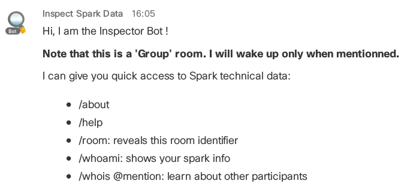

# Cisco Spark WebHook Examples in nodejs

Interested in creating your own Cisco Spark bots ? Pick an example that suits your scenario, and customize it.

To run any of these examples, follow the [How to run on Cloud9](docs/HowToRunOnCloud9.md) or [How to run locally](docs/HowToRegisterOnSpark.md) guide.

The examples below leverage the [sparkbot-webhook](sparkbot) nodejs library.  
To learn more about the library, check the [tests](tests/README.md) examples.

## [inspect](examples/inspector.js)

Provides instant access to Cisco Spark technical data.

Add _inspect@sparkbot.io_ to a Spark Room to experiment this bot.

## [room-stats](examples/room-stats.js)

Computes stats for the room it is invoked from. 

Tip: Run this webhook with a Developer access token (either you or a fake spark account) as the code needs to access all past messages from the room.

## [events](examples/devnet/bot.js)

Tells you about upcoming DevNet events.

Add _CiscoDevNet@sparkbot.io_ to a Spark Room to experiment this bot.

## [dilbert](examples/dilbert/bot.js)

Fetches latest comic from Dilbert Strip (with kind invitation to visit the Web Site)

# To go further

- Run other examples in this repo
- Take the DevNet Learning labs related to these code samples.
- Learn to host your bot on a public cloud.