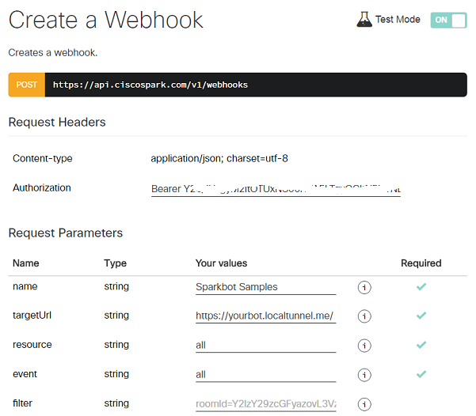

# How to Guide: run your Cisco Spark Bot locally

This guide details how to have your local bot (ie, running on a dev machine or a private network), talk to the Spark Cloud platform.

1. Start you bot
2. Check your bot is healthy 
3. Expose your bot 
4. Create a Spark Webhook 


## Start you bot

**Skip this (if you have already started your bot)**

Here are the steps to install this project samples and run them

1. Clone the repo
2. Install dependencies
3. Run an example 

``` bash
# Clone repo
> git clone https://github.com/CiscoDevNet/node-sparkbot-samples
# Install dependencies 
> cd sparkbot-webhook-samples
> npm install
# Run an example
> DEBUG=sparkbot*,samples* node tests/express-all-in-one.js
...
Cisco Spark Bot started at http://localhost:8080/
   GET  / for Health checks
   POST / receives Spark Webhook events
```

## Check your bot is healthy

Hit localhost to check your bot is running, either via [your Web browser](http://localhost:8080) or via CURL (see below)
You should get back an JSON payload with your bot properties.

``` bash
# Ping your bot
> curl http://localhost:8080
...
{
  "message": "Congrats, your Cisco Spark webhook is up and running",
  "since": "2016-09-01T13:15:39.425Z",
  "listeners": [
    ...
```


## Expose you bot 

To expose your boot on the internet, we'll leverage a tunnelling tool. 
You may pick any tool, the steps below leverage localtunnel. 

There you need to choose a unique subdomain name, which localtunnel will use to create your bot public internel URL.

Replace **<yourbot>** in the following steps by your bot subdomain name.

Note : make sure you hit your bot **secured** HTTPS endpoint. 


``` bash
# Install local tunnel
> npm install localtunnel -g
# Create the tunnel
> lt -s <yourbot> -p 8080
your url is: http://<yourbot>.localtunnel.me

# In another terminal, check your bot is accessible
> curl https://<yourbot>.localtunnel.me/
{
  "message": "Congrats, your Cisco Spark webhook is up and running",
  "since": "2016-09-01T13:15:39.425Z",
  "listeners": [
    "messages/created"
  ],
  "token": true,
  "account": {
    "type": "human",
    "person": {
      "id": "Y2lzY29zcGFyazovL3VzL1BFT1BMRS85MmIzZGQ5YS02NzVkLTRhNDEtOGM0MS0yYWJkZjg5ZjQ0ZjQ",
      "emails": [
        "stsfartz@cisco.com"
      ],
      "displayName": "Steve Sfartz",
      "avatar": "https://1efa7a94ed216783e352-c62266528714497a17239ececf39e9e2.ssl.cf1.rackcdn.com/V1~c2582d2fb9d11e359e02b12c17800f09~aqSu09sCTVOOx45HJCbWHg==~1600",
      "created": "2016-02-04T15:46:20.321Z"
    }
  },
  "interpreter": {
    "prefix": "/",
    "trimMention": true,
    "ignoreSelf": false
  },
  "commands": [
    "help"
  ],
  "tip": "Register your bot as a WebHook to start receiving events: https://developer.ciscospark.com/endpoint-webhooks-post.html"
}
```


## Register your bot as a Spark WebHook

Last step, is to create a Spark Webhook for your bot.

This can be done via the Cisco Spark Developer Portal / [Create a WebHook](https://developer.ciscospark.com/endpoint-webhooks-post.html) interactive documentation,
but also via Postman or a CURL command as will see right after.

### via the interactive documentation

For the scope of this example, we'll associate our bot to all resources and events.

Note: even if our webhook can process all events, you can register a webhook with a more limited set of events. Then Spark will then invoke your webhook only if those events happen (whatever your bot can process).




### via CURL

As an alternative, you can run this CURL command.

``` bash
> curl -X POST -H "Content-Type: application/json" -H "Authorization: Bearer YOUR_SPARK_TOKEN" -d '{
        "name": "Sparkbot Samples",
        "resource": "all",
        "event": "all",
        "targetUrl": "https://yourbot.localtunnel.me/"
    }' "https://api.ciscospark.com/v1/webhooks/"
```


### via postman

Or you can also create this webhook via Postman.


